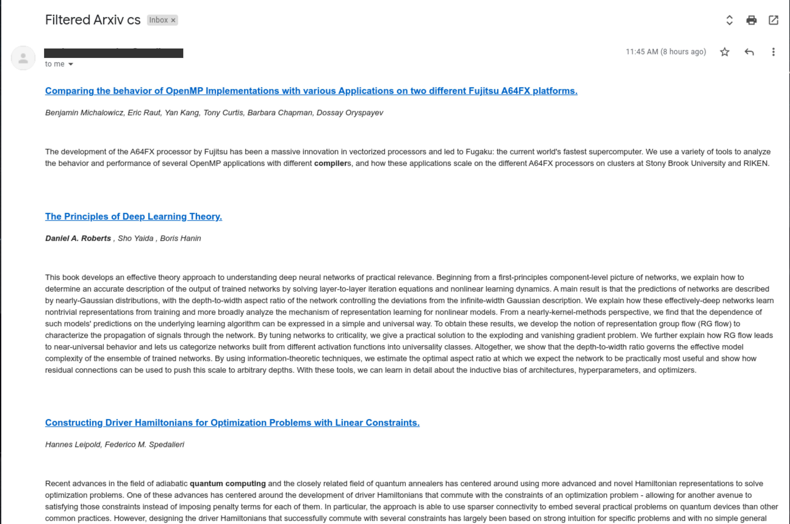
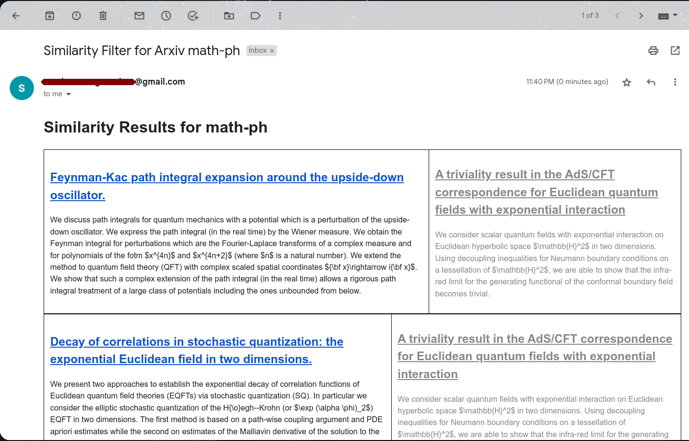

# arxivFilterEmailer

A metadata filter and a ML based similarity filter.

## Metadata Filter

A simple arxiv filter and emailer using keywords.  I run this on a cron job daily for getting filterd email results from the arxiv rss feed.




In order to use one needs to create a 'config.py' file and create a few dictionaries.  See 'sampleConfig.py' to see the necessary dictionary information.

If 'IMPORT_DROPBOXFILE' is true the code will use the config files dropbox token to download 'arxivMeta.json' otherwise it will use the local copy (the arxivMeta file needs to be in the arxiv root directory).

The 'arxivMeta.json' contains a json file with and array of objects of the form:

```json
{
    "arxivSite": "cs",
    "authors": [
        "Ian Goodfellow",
        "Daniel A. Roberts"
    ],
    "words": [
        "quantum computing",
        "RTOS"
    ]
}
```

Here 'arxivSite' is the arxive site (cs or hep-th for example), 'authors' is an arxiv author you want filtered (copy and paste the author name from arxiv, needs to be full name), and 'words' are a set of words you want filtered from the abstracts.

Running this around mid-day should run the filter and send an email.  It's best to set up a cron job as needed, see 'cronText.txt' as an example for a daily emailer.


## Similarity Filter

### Description

Using [Sci-bert](https://github.com/allenai/scibert) as a sentence encoder.  The file `ArxivEmailerFromSimilarity.py` uses machine learning sentence
embeddings to measure the text similarity between two arxiv articles.

The program finds similar articles to the ones listed in the file `arxivSimilarity.json`.  The following is an example output:



A sample json file is provided.  The structure of the Json file is:

```json
{
    "settings": {
        "num_similar_sentences": 4,
        "title_similarity_threshold": 0.82,
        "sentence_similarity_threshold": 0.82,
        "and_conditional": true
    },
    "similarity_searches":
    [
        {
            "arxivSite": "cs",
            "papers": 
            [
                "https://arxiv.org/abs/2111.00396",
                "https://arxiv.org/abs/2305.02323"
            ]
        },
        {
            "arxivSite": "math-ph",
            "papers": 
            [
                "https://arxiv.org/abs/2305.02494",
                "https://arxiv.org/abs/2305.02788"
            ]
        }
    ]
}
```

where `papers` are arxiv links to the paper you want to find similar matches.  The search is divided within different arxiv sites.

### Similarity

Define $S_{title}$ as the similarity of the title and $S_{sen}(k)$ as the average of the $k=$`num_similar_sentences` for the top $k$ similar sentences. 
A paper is deemed **similar** if the following logical formula is true:

$$
S_{title} > \tau_{title} \,\, \mathcal{O} \,\, S_{title}(k) > \tau_{sen}
$$

where the $\tau$'s are the thresholds defined in the config file and $\mathcal{O}$ is "and" if `and_conditional` is true and "or" otherwise.
One might need to modify the scores as needed.